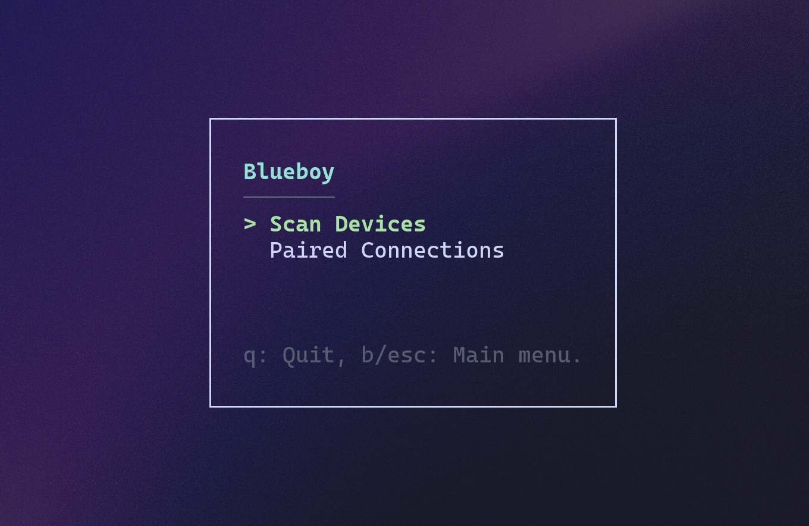
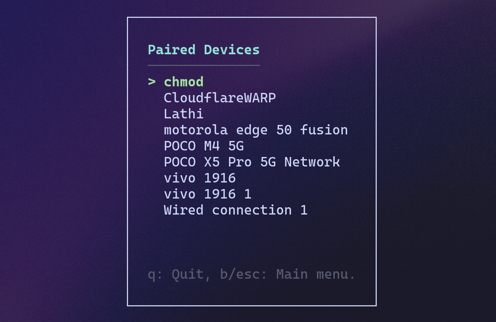
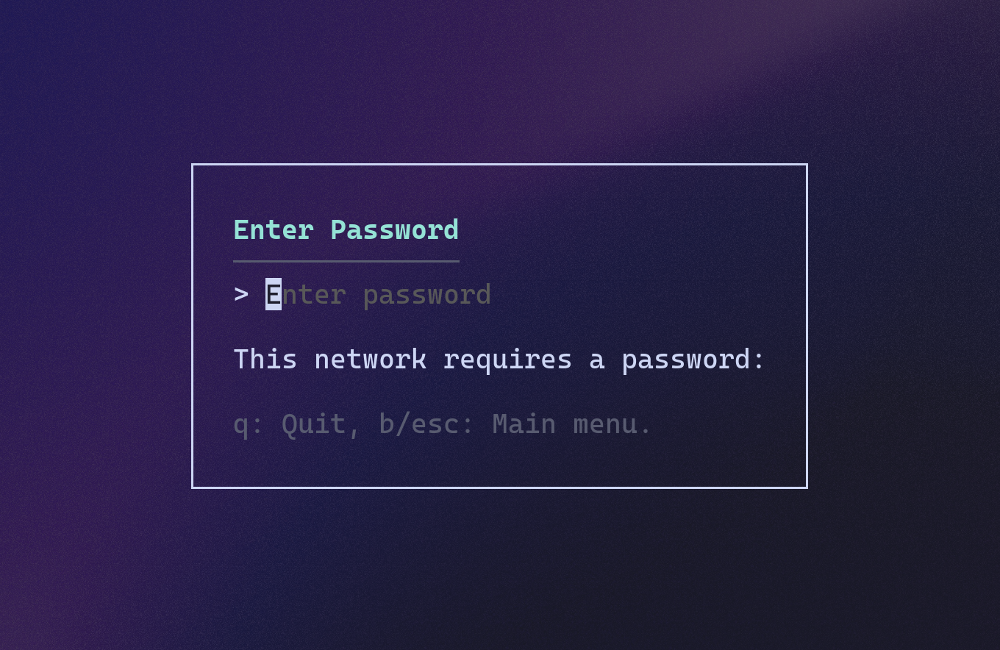

# Blueboy - TUI Network Manager (Go)

A terminal-based Wi-Fi manager built using [`bubbletea`](https://github.com/charmbracelet/bubbletea), providing a keyboard-driven interface to scan, view, and connect to networks via `nmcli`.

---

## Features

- TUI for scanning and managing Wi-Fi connections  
- View paired devices and connect to them  
- Connect to new networks (secured/open)  
- Password prompt for secured Wi-Fi  
- Vim-style keybindings (`j`/`k` for navigation)  
- Minimal UI with clear feedback and status  

---

## Keybindings

| Key         | Action                        |
|------------:|-------------------------------|
| `q`/`Ctrl+C` | Quit                          |
| `j`/`↓`      | Move cursor down              |
| `k`/`↑`      | Move cursor up                |
| `enter`      | Select / Connect              |
| `b`/`esc`    | Back to main menu             |

---

## Requirements

- Linux system with [`nmcli`](https://wiki.archlinux.org/title/NetworkManager#nmcli)  
- Go ≥ 1.18  

---

## Installation (Linux)

```bash
git clone https://github.com/yourname/blueboy.git
cd blueboy
go build -o blueboy
sudo mv blueboy /usr/local/bin
```

Now run it from anywhere:

```bash
blueboy
```

---

## Screenshots

### Main Menu  


### Paired Devices Menu  


### Password Input Prompt  


---

## License

MIT
